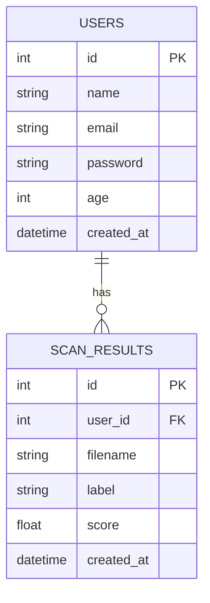

HMM# Database Design - Deepfake Detection System

This document outlines the database schema and relationships for the Deepfake Detection System.

## Entity Relationship Diagram

## Tables Description

### 1. `users`
Stores information about registered users of the system.

| Column | Type | Description |
| :--- | :--- | :--- |
| `id` | Integer | Unique identifier for the user (Primary Key). |
| `name` | String | Full name of the user. |
| `email` | String | Unique email address used for login. |
| `password` | String | Hashed password. |
| `age` | Integer | Age of the user. |
| `created_at` | DateTime | Timestamp when the user record was created. |

### 2. `scan_results`
Stores the results of deepfake scans performed by users.

| Column | Type | Description |
| :--- | :--- | :--- |
| `id` | Integer | Unique identifier for the scan record (Primary Key). |
| `user_id` | Integer | Reference to the user who performed the scan (Foreign Key). |
| `filename` | String | Name of the file uploaded for scanning. |
| `label` | String | Detection result (e.g., "Natural", "Suspicious", "Fake"). |
| `score` | Float | Probability/Score of the detection result. |
| `created_at` | DateTime | Timestamp when the scan was performed. |

## Relationships
- **one-to-many**: A single `User` can have multiple `ScanResult` records associated with them through the `user_id` foreign key.
